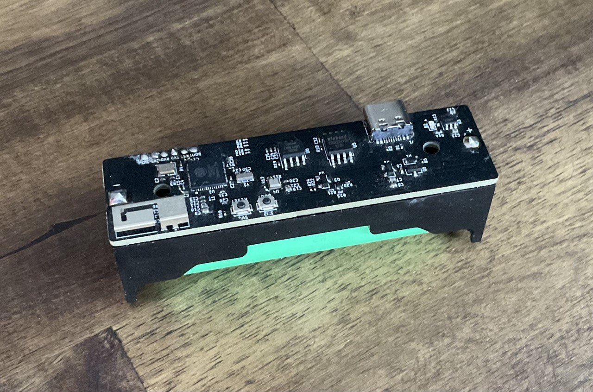

# Nodeup

A server application for managing and configuring ESP32 based weatherstation units. Communication happens over a custom wifi protocol. The server app and the units are capable of over-the-air updates.

Custom-made ESP32 weatherstation.

Project structure:
  boostrap: Contains a stub loader for downloading and running the main app.
  native: C libarry loaded via the JNI by the main app. Used for communication with a wifi nic.
  server: The main app.
  updateConfigBuilder: Used in the build pipeline to create configuration files for the bootstrap app.
